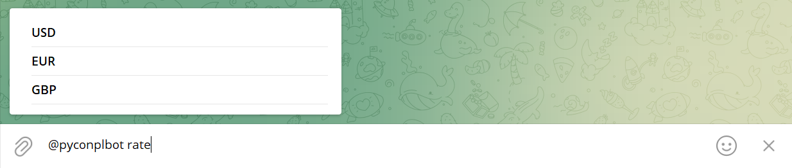

# End-to-end Telegram bot development and deployment

## Download Telegram Desktop
Navigate to https://desktop.telegram.org/ to download Telegram Desktop.

## BotFather
### Create a new bot with BotFather
Search for `@BotFather` Telegram bot and click `START` button:


Send `/newbot` command:


Send bot name (e.g., `PyConPLBot`):


Send bot username (e.g., `PyConPLBot`). It must end with `bot`:


Copy and save the token (e.g., `5741693832:AAFyfYpqWRHaGVhTt9CO4edV7bTlNR7bvaA`):


### Turn on inline mode
Navigate to `@BotFather` Telegram bot and send `/mybots` command:


Choose a bot from the list (e.g., `@PyConPLBot`):


Click `Bot Settings` button:


Click `Inline Mode` button:


Click `Turn on` button:


### Add inline placeholder
Click `Edit inline placeholder` button:


Send placeholder (e.g., `buy and sell prices of foreign currencies`):


Success! Inline setting updated:


## Host Telegram bot locally
### Hello world bot with pyTelegramBotAPI
Lets start with `Hello, World!` bot written with pyTelegramBotAPI.
```sh
$ git clone https://github.com/korniichuk/telegram-pycon-pl-2022.git
$ cd telegram-pycon-pl-2022
```

Install requirements:
```sh
$ pip install -r requirements.txt
```

Create .env file with token:
```sh
$ touch .env
```

Copy and past token to .env file:
```sh
$ echo TOKEN=<TOKEN> > .env

```

Example:
```sh
$ echo TOKEN=5741693832:AAFyfYpqWRHaGVhTt9CO4edV7bTlNR7bvaA > .env
```

Start `Hello, World!` bot:
```sh
$ python3 bot1.py
```

Navigate to your Telegram bot (e.g., `@PyConPLBot`) and click `START` button:


You can achieve the same result with `/start` command.

### Synchronous NBP bot with pyTelegramBotAPI
```sh
$ python3 bot2.py
```
Navigate to your Telegram bot (e.g., `@PyConPLBot`) and send `/start` command.

Test `table A`, `table B`, and `table C` buttons:


Send `/a`, `/b`, and `/c` commands:


Create a new Telegram group (e.g., `PyCon PL group`).
Add your Telegram bot (e.g., `@PyConPLBot`) to the group.
Add your friend(s) (optional).

Test `/start@<you_bot_username>` (e.g., `/start@pyconplbot`) command:


Communication with Telegram bots is not always easy.
You had to send them messages in separate chats or add them to your groups.

With the `inline mode`, bots become omnipresent and can be used as a tool in any of your chats, groups or channels – it doesn't matter, whether the bot is a member or not.

Open chat with your friend(s) or create a new Telegram group, and type the username of your bot (e.g., `@pyconplbot`).
You can see inline placeholder now (e.g., `buy and sell prices of foreign currencies`):


Type space and `rate` command (e.g., `@pyconplbot rate`):



Select `USD`:


See result:


### Asynchronous NBP bot with pyTelegramBotAPI
```sh
$ python3 bot3.py
```

### Asynchronous NBP bot with python-telegram-bot
```sh
$ python3 bot4.py
```

### Asynchronous NBP bot with aiogram
```sh
$ python3 bot5.py
```

**Note:** Parse mode `Markdown` is legacy since Telegram Bot API 4.5, retained for backward compatibility. Source: https://core.telegram.org/bots/api#formatting-options


## Deploy on AWS with Elastic Beanstalk
The following example is written on pyTelegramBotAPI. See aiogram example: https://stackoverflow.com/a/64911415

### AWS CLI
Install AWS CLI:
```sh
$ curl "https://awscli.amazonaws.com/awscli-exe-linux-x86_64.zip" -o "awscliv2.zip"
$ unzip awscliv2.zip
$ sudo ./aws/install

$ aws --version
```

**Source:** https://docs.aws.amazon.com/cli/latest/userguide/getting-started-install.html#getting-started-install-instructions

### EB CLI
Install EB CLI:
```sh
$ pip install awsebcli

$ eb --version
```

**Source:** https://docs.aws.amazon.com/elasticbeanstalk/latest/dg/eb-cli3-install-advanced.html

### EB init
Navigate to `aws-elastic-beanstalk` folder and initialize the directory with the EB CLI:

```sh
$ cd aws-elastic-beanstalk

$ eb init
```

Select a default region (e.g., `eu-west-1`). Enter a new application name for your Elastic Beanstalk application (e.g., `telegram`).

```
It appears you are using Python. Is this correct?
(Y/n):
```

Enter `Y`.

Select a platform branch (e.g., `Python 3.8 running on 64bit Amazon Linux 2`). Details: https://docs.aws.amazon.com/elasticbeanstalk/latest/platforms/platforms-supported.html#platforms-supported.python

```
Do you want to set up SSH for your instances?
(Y/n):
```

Enter `Y`.

### EB create
Create a new Elastic Beanstalk environment:
```sh
$ eb create
```

Enter environment name (e.g., `telegram-dev`).
Enter DNS CNAME prefix (e.g., `telegram-dev`).
Select a load balancer type (e.g., `application`).

```
Would you like to enable Spot Fleet requests for this environment? (y/N):
```

Enter `N`.

### EB setenv
To set Telegram token as an environment variable in the EB CLI, run the following command:

```sh
$ eb setenv TOKEN=<TOKEN>
```

Example:
```sh
$ eb setenv TOKEN=5741693832:AAFyfYpqWRHaGVhTt9CO4edV7bTlNR7bvaA
```

**Source:** https://aws.amazon.com/premiumsupport/knowledge-center/elastic-beanstalk-pass-variables/

### EB deploy
To deploy new source code to the environment:
```sh
$ eb deploy
```

### EB open
Open the EB application URL in a browser:
```sh
$ eb open
```

If you can see exclamation mark, Telegram bot deployed successfully:
 


### Domain name
**This part is out of workshop scope!**
We need to purchase and configure a custom domain name (e.g., `telegrambot.click` for 3 USD) for our Elastic Beanstalk environment.

### SSL certificate
**This part is out of workshop scope!**
We need use HTTPS to allow secure connection.

To set up SSL we need to obtain SSL certificate:
1. Navigate to AWS Certificate Manager (ACM).
2. Click `Request certificate` link or `Request` button. Select `Request a public certificate`. Click `Next`.
3. Add two domain names: one for website (e.g., `korniichuk.click`) and one wildcard domain (e.g., `*.korniichuk.click`). It will cover all subdomains including www or any other.
4. Select `DNS validation` and click `Request` button.

Because we delegated domain management to AWS, we need to validate ownership by expanding any domain and clicking `Create records in Route 53`.

SSL certificate will be issued after a while (it can take up to 48 hours - usually within 30 minutes after nameservers delegation is completed).

**Source:** https://dev.to/bnn1/deploying-dockerized-nextjs-app-to-aws-eb-part-3-setting-custom-domain-45bm

### Fix security group
**This part is out of workshop scope!**
We need to modify Load Balancer security group to allow secure connections:
1. Navigate to Amazon EC2.
2. On `Load Balancers` page select your load balancer.
3. Scroll down `Description` tab until `Security section`.
4. Copy security group name and open link near it.
5. On the `Security Groups` page search the page for security group name you copied earlier, click on `Security group ID`.
6. On opened page click `Edit inbound rules`, then click `Add rule`.
7. Set `HTTPS` type, and `Anywhere-IPv4` source, save rule and close the page.

**Source:** https://dev.to/bnn1/deploying-dockerized-nextjs-app-to-aws-eb-part-3-setting-custom-domain-45bm

### Add listener
**This part is out of workshop scope!**
1. Navigate to Amazon EC2.
2. On `Load Balancers` page select your load balancer.
3. Select `Listeners` tab and copy default rule for HTTP listener (`Default: forwarding to …`).
4. Click `Add listener` button.
5. Select `HTTPS` protocol from the dropdown.
6. In Default actions click `Add action`->`Forward`
7. From the `Target group` dropdown select the same group you copied earlier from HTTP listener default action.
8. From `Security policy` dropdown select suitable policy (`ELBSecurityPolicy-2016-08` policy is recommended). More about policies: https://docs.aws.amazon.com/elasticloadbalancing/latest/network/create-tls-listener.html
9. Select `Default SSL/TLS certificate` you created earlier and click `Add`.

**Source:** https://dev.to/bnn1/deploying-dockerized-nextjs-app-to-aws-eb-part-3-setting-custom-domain-45bm

### Add DNS record
**This part is out of workshop scope!**


### Setting Telegram bot WebHook
All you have to do is to call the [setWebhook method](https://core.telegram.org/bots/api#setwebhook) in the Bot API via the following url:

`https://api.telegram.org/bot{TOKEN}/setWebhook?url={URL}/`

Where:
- `TOKEN` -- token you got from BotFather when you created your bot,
- `URL` -- your domain name (must be HTTPS).

Exmaple:

`https://api.telegram.org/bot5741693832:AAFyfYpqWRHaGVhTt9CO4edV7bTlNR7bvaA/setWebhook?url=https://korniichuk.click/`

**Source:** https://xabaras.medium.com/setting-your-telegram-bot-webhook-the-easy-way-c7577b2d6f72

## Deploy on AWS with SAM
```ssh
$ cd aws-elastic-beanstalk
$ eb init
```

To delete bot from AWS cloud, terminate the environment:
```ssh
$ eb terminate
```

## Extra sources
1. [Error code: 429. Description: Too Many Requests](https://github.com/eternnoir/pyTelegramBotAPI/issues/253)
